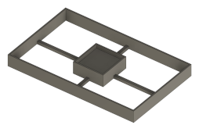

# USPS Small Flat Rate Box

This model suspends the processor in the middle of a USPS flat rate box in such a way it will be held stationary in
transport and add structural support to the box itself.

## Demo Video

## Requirements

- 1 USPS Small Flat Rate Box Marketed Under the SKU
[OSMALLFRBI](https://store.usps.com/store/product/shipping-supplies/priority-mail-small-flat-rate-box-P_SMALL_FRB) or
[PPSFRB](https://store.usps.com/store/product/shipping-supplies/priority-mail-forever-prepaid-small-box-P_PPSFRB) (pre
paid).

- Filament of choice:
  - TPU - Good if you expect the package to be handled roughly
  - PLA/PETG - Will support the box more rigidly but less ductility in packging material

### Min Recommended Print Settings

- Shells: 2.4mm / (2 * Nozzle Width)
  - Ex: 2.4mm/(2*.6mm) -> 2 Shells
  - Ensures outer supports are solid plastic with infill only in the center structure
- Layer Height: 50% Nozzle Size (.6mm Nozzle -> .3 mm Layer Height)
- Infill: 15% Gyroidal (or alternative infill of choice)

### Instructions

- Print 1 BritsFabrication AM4 CPU Tray (
[repo copy](../../Common/BritsFabrication-am4-amd-cpu-tray-box/am4_cpu_box.stl)/
[Cults3d](https://cults3d.com/en/3d-model/home/am4-amd-cpu-tray-box)/
[Thingiverse](https://www.thingiverse.com/thing:3788117))
  - For print settings, License and Attribution see [documentation for this asset](../../Common/BritsFabrication-am4-amd-cpu-tray-box/README.md)
- Print 2 Copies of the [USPS Small Flat Rate Box Support](AM4_USPS_FLAT_RATE_SMALL_BOX_OSMALLFRBI.stl)
- Place AM4 CPU in CPU Tray and slide it into CPU tray sleeve
  - OPTIONAL - Use painter's tape or masking tape to secure tray in sleeve; avoid stronger tape to make it easier to remove by the recipient
- Place CPU Tray into center-recessed portion of the support
- Place other support printed on top
  - OPTIONAL - Use painter's tape or masking tape to secure two halves together; avoid stronger tape to make it easier to remove by the recipient
- Place in unfolded flat rate box and fold it around the support
- Remove protective plastic from pre-applied adhesive and seal the package
